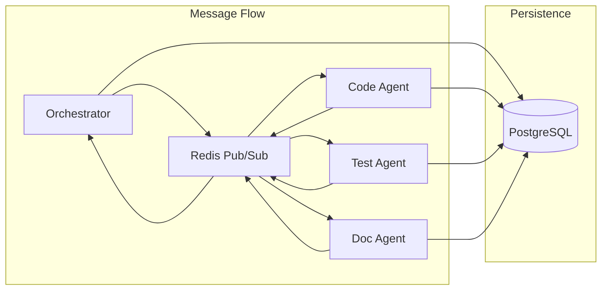

# Novitas Implementation Plan 🗺️

## 📊 **Current Status: Phase 2 In Progress 🚀**

**🎉 Phase 1: Foundation (Weeks 1-2) - COMPLETED**
- ✅ Project Setup & Infrastructure
- ✅ Database Layer (PostgreSQL + SQLAlchemy + Alembic)
- ✅ Core Domain Models & Events
- ✅ Configuration System (12-Factor App compliant)
- ✅ CLI Interface
- ✅ Testing Foundation (>80% coverage)

**🚀 Phase 2: Intelligence (Weeks 3-4) - IN PROGRESS**
- ✅ LLM Provider Layer (Protocol-based with LangChain)
- 🔄 Base Agent Infrastructure
- 🔄 Code Analysis & Change Generation

---

## 🎯 Technical Decisions & Architecture

### 🏗️ Core Technology Stack

| Component                | Technology           | Rationale                                             |
| ------------------------ | -------------------- | ----------------------------------------------------- |
| **Language**             | Python 3.11+         | Rich ML/AI ecosystem, async support, type hints       |
| **Package Manager**      | uv                   | Faster than pip/poetry, modern dependency resolution  |
| **Web Framework**        | FastAPI              | Async-first, type-safe, auto-documentation            |
| **Database**             | PostgreSQL + AsyncPG | JSONB for flexible schemas, excellent async support   |
| **Cache/Message Broker** | Redis                | Fast pub/sub, session storage, task queues            |
| **ORM**                  | SQLAlchemy 2.0       | Mature, async support, type safety                    |
| **Validation**           | Pydantic v2          | Type validation, serialization, settings management   |
| **LLM Integration**      | LangChain            | Agent frameworks, provider abstraction                |
| **Code Quality**         | Ruff + MyPy          | Fastest linter/formatter, comprehensive type checking |
| **Testing**              | Pytest + AsyncIO     | Comprehensive async testing support                   |
| **CI/CD**                | GitHub Actions       | Native integration, cron scheduling                   |

### 🧠 Agent Communication Architecture



**Key Design Principles:**

- **Hub-and-Spoke**: All agents communicate through orchestrator only
- **Message-Based**: Async pub/sub for scalability  
- **State Persistence**: Full state snapshots for recovery
- **Event Sourcing**: All actions logged for analysis

---

## 📅 Phase-by-Phase Implementation

### 🚀 Phase 1: Foundation (Weeks 1-2)

#### Week 1: Core Infrastructure

  - [x] **Project Setup**
  - [x] Modern Python project structure (`src/` layout)
  - [x] pyproject.toml with uv + ruff configuration
  - [x] GitHub Actions CI pipeline
  - [x] Pre-commit hooks and code quality tools
  - [x] **Database Layer**

  ```python
  # Priority: HIGH
  # Files: src/novitas/database/
  - connection.py        # Async database connection pool ✅
  - models.py           # SQLAlchemy models ✅
  - repositories.py     # Repository pattern implementation ✅
  - migrations/         # Alembic migration files ✅
  ```

- [x] **Core Domain Models**

  ```python
  # Priority: HIGH  
  # Files: src/novitas/core/
  - models.py          # Pydantic domain models ✅
  - protocols.py       # Interface definitions ✅
  - exceptions.py      # Custom exception hierarchy ✅
  - events.py          # Domain events for event sourcing ✅
  ```

#### Week 2: CLI & Configuration

- [x] **Configuration System**

  ```python
  # Priority: HIGH
  # Files: src/novitas/config/
  - settings.py        # Pydantic settings ✅
  - logging.py         # Structured logging setup ✅
  - prompts.py         # Prompt loading and management ✅
  ```

- [x] **CLI Interface** 
  ```python
  # Priority: MEDIUM
  # Files: src/novitas/cli.py ✅
  # Features:
  - System initialization commands ✅
  - Agent management commands ✅
  - Session control commands ✅
  - Status and monitoring commands ✅
  ```

- [x] **Testing Foundation**
  ```python
  # Priority: HIGH
  # Files: tests/
  - conftest.py        # Pytest fixtures and configuration ✅
  - factories.py       # Test data factories ✅
  - test_helpers.py    # Common testing utilities ✅
  ```

**Week 1-2 Success Criteria:**
- [x] Database migrations run successfully
- [x] CLI commands execute without errors  
- [x] All tests pass with >80% coverage
- [x] CI pipeline validates code quality

---

### 🧠 Phase 2: Intelligence (Weeks 3-4) 

#### Week 3: LLM Integration & Base Agent
- [x] **LLM Provider Layer**
  ```python
  # Priority: HIGH
  # Files: src/novitas/llm/
  - provider.py        # OpenAI/Anthropic provider implementation ✅
  # Features:
  - Protocol-based interface using LangChain ✅
  - Automatic provider detection from model name ✅
  - Structured response generation ✅
  - Streaming support ✅
  - Error handling and retry logic ✅
  ```

- [ ] **Base Agent Infrastructure**
  ```python
  # Priority: HIGH  
  # Files: src/novitas/agents/
  - base.py           # Base agent class ✅ (partial - needs lifecycle, communication, memory)
  - lifecycle.py      # Agent lifecycle management
  - communication.py  # Message passing implementation
  - memory.py         # Agent memory and context management
  ```

- [ ] **Message Broker Implementation**
  ```python
  # Priority: HIGH
  # Files: src/novitas/messaging/
  - broker.py         # Redis pub/sub implementation
  - channels.py       # Channel management and routing
  - serialization.py  # Message serialization/deserialization
  ```

#### Week 4: Code Analysis & Change Generation
- [ ] **Code Analysis Engine**
  ```python
  # Priority: HIGH
  # Files: src/novitas/analysis/
  - codebase.py       # Full codebase analysis
  - patterns.py       # Pattern detection and analysis
  - metrics.py        # Code quality metrics collection
  - ast_analysis.py   # AST-based code analysis
  ```

- [ ] **Change Management System**
  ```python
  # Priority: HIGH
  # Files: src/novitas/changes/
  - generator.py      # Change proposal generation
  - validator.py      # Change validation logic
  - applier.py        # Change application to codebase
  - conflict.py       # Conflict detection and resolution
  ```

**Week 3-4 Success Criteria:**
- [ ] LLM provider successfully generates structured responses
- [ ] Base agent can execute simple tasks
- [ ] Code analysis produces meaningful metrics
- [ ] Change proposals can be generated and validated

---

### 🔄 Phase 3: Automation (Weeks 5-6)

#### Week 5: Orchestrator & Session Management
- [ ] **Orchestrator Implementation**
  ```python
  # Priority: CRITICAL
  # Files: src/novitas/agents/orchestrator.py ✅ (skeleton - needs full implementation)
  # Key Features:
  - Session creation and management
  - Task assignment to agents  
  - Change evaluation and selection
  - Agent performance monitoring
  - Conflict resolution between agents
  ```

- [ ] **Session Management**
  ```python
  # Priority: HIGH
  # Files: src/novitas/sessions/
  - manager.py        # Session lifecycle management
  - scheduler.py      # Task scheduling and dependencies
  - monitor.py        # Session monitoring and metrics
  - recovery.py       # Session recovery and resumption
  ```

#### Week 6: GitHub Integration & Automation
- [ ] **Git Operations**
  ```python
  # Priority: HIGH  
  # Files: src/novitas/git/
  - operations.py     # Git command wrappers
  - branch.py         # Branch creation and management
  - commit.py         # Smart commit message generation
  - diff.py          # Diff analysis and validation
  ```

- [ ] **GitHub Integration**
  ```python
  # Priority: HIGH
  # Files: src/novitas/github/
  - client.py         # GitHub API client
  - pr_creator.py     # Pull request creation with reasoning
  - reviewer.py       # Automated code review requests
  - status.py         # Status check integration
  ```

- [ ] **Quality Gates**
  ```python
  # Priority: CRITICAL
  # Files: src/novitas/quality/
  - gates.py          # Quality gate enforcement
  - testing.py        # Automated test execution
  - linting.py        # Code quality validation
  - security.py       # Security scanning integration
  ```

**Week 5-6 Success Criteria:**
- [ ] Orchestrator can coordinate multiple agents
- [ ] Sessions complete end-to-end successfully
- [ ] Pull requests are created with proper reasoning
- [ ] All quality gates pass before PR creation

---

### 🌟 Phase 4: Evolution (Weeks 7-8)

#### Week 7: Specialized Agents
- [ ] **Code Agent Implementation**
  ```python
  # Priority: HIGH
  # Files: src/novitas/agents/code_agent.py
  # Capabilities:
  - Code smell detection and refactoring
  - Performance optimization suggestions  
  - Bug pattern identification
  - Architecture improvement proposals
  ```

- [ ] **Test Agent Implementation**
  ```python
  # Priority: HIGH
  # Files: src/novitas/agents/test_agent.py  
  # Capabilities:
  - Test coverage gap analysis
  - Test case generation
  - Test quality improvement
  - Mutation testing integration
  ```

- [ ] **Documentation Agent Implementation**
  ```python
  # Priority: MEDIUM
  # Files: src/novitas/agents/doc_agent.py
  # Capabilities:  
  - Docstring generation and improvement
  - README maintenance
  - API documentation updates
  - Architecture diagram generation
  ```

#### Week 8: Agent Evolution & Learning
- [ ] **Performance Tracking**
  ```python
  # Priority: HIGH
  # Files: src/novitas/evolution/
  - metrics.py        # Agent performance metrics
  - scoring.py        # Change success scoring
  - analytics.py      # Trend analysis and insights
  - reporting.py      # Performance reporting
  ```

- [ ] **Agent Lifecycle Management**
  ```python
  # Priority: HIGH
  # Files: src/novitas/evolution/
  - creator.py        # Dynamic agent creation
  - retiree.py        # Agent retirement logic
  - archiver.py       # Agent state archival
  - genetic.py        # Genetic algorithm for agent improvement
  ```

**Week 7-8 Success Criteria:**
- [ ] Each specialized agent produces quality improvements
- [ ] Agent performance is tracked and analyzed
- [ ] Underperforming agents are retired automatically
- [ ] New agents are created based on needs

---

### 🎯 Phase 5: Optimization (Weeks 9-10)

#### Week 9: Advanced Features
- [ ] **Prompt Self-Modification**
  ```python
  # Priority: MEDIUM
  # Files: src/novitas/prompts/
  - optimizer.py      # Prompt performance optimization
  - versioning.py     # Prompt version management
  - testing.py        # Prompt A/B testing
  - evolution.py      # Evolutionary prompt improvement
  ```

- [ ] **Advanced Analytics**
  ```python
  # Priority: MEDIUM  
  # Files: src/novitas/analytics/
  - dashboard.py      # Metrics dashboard
  - trends.py         # Long-term trend analysis
  - predictions.py    # Predictive analytics
  - insights.py       # Automated insight generation
  ```

#### Week 10: Production Hardening
- [ ] **Observability & Monitoring**
  ```python
  # Priority: HIGH
  # Files: src/novitas/observability/
  - tracing.py        # Distributed tracing
  - metrics.py        # Prometheus metrics export
  - alerting.py       # Alert generation and routing
  - health.py         # Health check endpoints
  ```

- [ ] **Production Features**
  ```python
  # Priority: HIGH
  # Files: src/novitas/production/
  - scaling.py        # Horizontal scaling support
  - security.py       # Enhanced security features
  - backup.py         # Data backup and recovery
  - deployment.py     # Deployment automation
  ```

**Week 9-10 Success Criteria:**
- [ ] System runs reliably in production
- [ ] Comprehensive monitoring and alerting
- [ ] Performance optimized for scale
- [ ] Security hardened for public deployment

---

## 🛠️ Key Technical Challenges & Solutions

### 🔧 Challenge 1: Agent Coordination
**Problem**: Preventing conflicts when multiple agents propose changes to the same code.

**Solution**: 
- Orchestrator-mediated communication only
- File-level locking during change application
- Semantic conflict detection using AST analysis
- Change scoring and prioritization system

### 🔧 Challenge 2: Quality Assurance  
**Problem**: Ensuring agent-generated changes don't break the system.

**Solution**:
- Comprehensive test suite execution before PR creation
- Static analysis and security scanning
- Gradual rollback capability
- Human review requirement for high-risk changes

### 🔧 Challenge 3: Agent Learning
**Problem**: How agents learn from past successes and failures.

**Solution**:
- Event sourcing for all agent actions
- Success/failure feedback loops
- Prompt optimization based on outcomes
- Performance metric tracking per agent

### 🔧 Challenge 4: Scalability
**Problem**: System performance with many agents and large codebases.

**Solution**:
- Async-first architecture throughout
- Redis for fast message passing
- Database connection pooling
- Incremental analysis for large codebases

---

## 📋 MVP Definition

### 🎯 Minimum Viable Product (End of Phase 3)
A working system that can:
1. ✅ Start daily via GitHub Actions
2. ✅ Analyze current codebase for improvement opportunities  
3. ✅ Generate and apply code improvements
4. ✅ Create pull requests with human-readable reasoning
5. ✅ Pass all quality gates (tests, linting, security)

### 🏆 Success Metrics
- **Functional**: 90% of daily sessions complete successfully
- **Quality**: All generated PRs pass CI checks
- **Value**: At least 50% of generated PRs get merged
- **Performance**: Complete session in under 30 minutes

---

## 🤔 Key Decisions to Make

### 1. **LLM Provider Strategy**
- **Option A**: OpenAI only (simpler, proven)
- **Option B**: Multi-provider with fallbacks (resilient, expensive)
- **Recommendation**: Start with OpenAI, add providers later

### 2. **Agent Persistence**
- **Option A**: Full state snapshots (simple, potentially large)
- **Option B**: Event sourcing (complex, complete audit trail)
- **Recommendation**: Full state snapshots initially, migrate to events later

### 3. **Change Conflict Resolution**  
- **Option A**: First-come-first-served (simple, potentially unfair)
- **Option B**: Scoring-based selection (fair, requires complex scoring)
- **Recommendation**: Hybrid approach with file-level locks and scoring

### 4. **Deployment Model**
- **Option A**: Single repository self-improvement (focused)
- **Option B**: Multi-repository coordination (scalable, complex)
- **Recommendation**: Single repository MVP, multi-repo as Phase 6

---

This implementation plan provides a clear roadmap for building Novitas incrementally while maintaining quality and ensuring each phase delivers value. Each phase builds on the previous one, allowing for early testing and feedback.